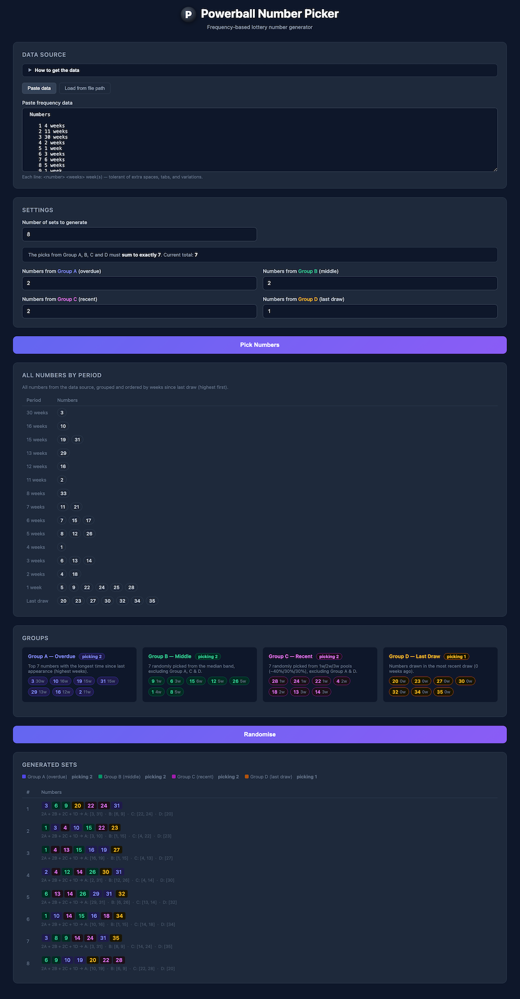

# Lottery Playground

My Playground - Lottery Picker (vibe coded)

## Features

- Powerball (AU) picker
  - Generate numbers from 4 groups, base on how long the numbers haven't been drew
  - Adjust how many number you want to come out of the 4 groups
  - Set how many sets you want to generate
  - Check generated numbers aginst winning numbers
  - Ability to bookmark and share the result

## To use

- Download the html file (e.g. powerball.html) and open in browser
- Follow the instructions on the page

## Why

- Lottery picker is one of my very first personal project that I wrote in PHP back in maybe 2002. It is fun to have AI to recreate some of its functionality. And no, I don't have the php source anymore :(
- I vibed coded a simple Powerball (AU) picker today, and purchased 8 games it generated. Let's see will I win anything today (2026-04-09)
  - Probably as expected, winning nothing..

## Vibe coding

This is totally vibe coded using Claude Code Sonnet 4.6, done in couple of hours.
